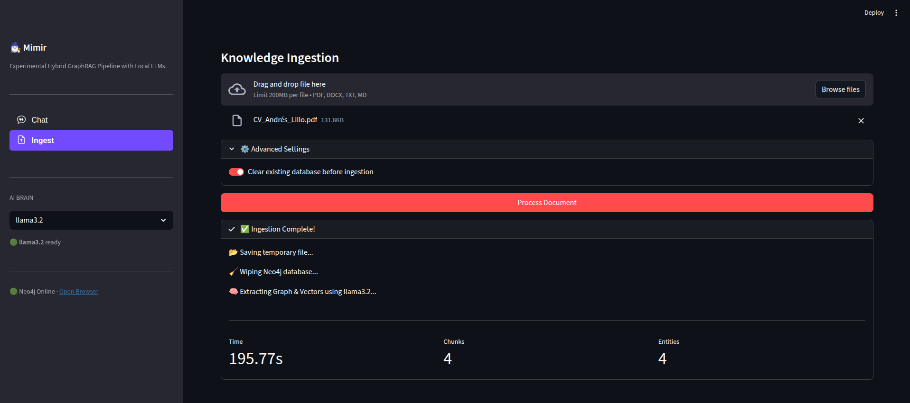
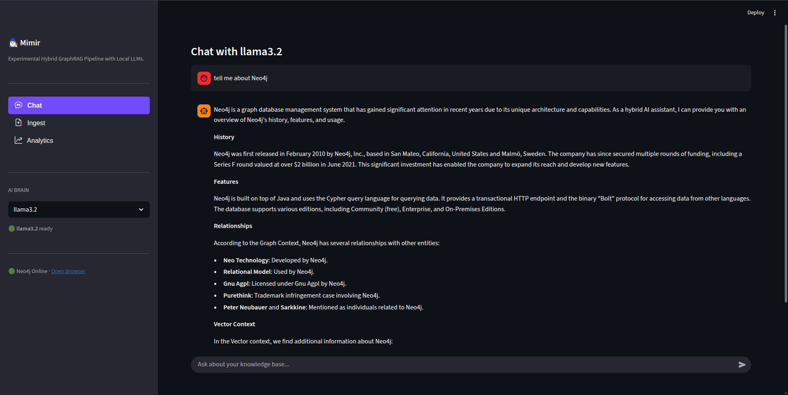

# Mimir

Experimental Hybrid GraphRAG Pipeline for Knowledge Graph Construction and Querying with Local LLMs.

## About the Project

Mimir is an open-source tool designed to experiment with Hybrid Graph Retrieval-Augmented Generation (GraphRAG) using local Large Language Models. The application serves as a privacy-focused proof-of-concept, allowing users to ingest documents in various formats such as PDF, DOCX, TXT, and Markdown. It utilizes models like Llama 3.2 via Ollama to process this data locally, constructing a robust knowledge base without relying on external cloud APIs.

To achieve high-accuracy retrieval, Mimir performs a dual ingestion process that captures both structure and meaning. It employs an LLM to extract structured entities and relationships to build a Knowledge Graph within a Neo4j database, while simultaneously generating semantic vector embeddings using the nomic-embed-text model. This hybrid approach ensures that the system captures both the explicit structural connections between concepts and the implicit semantic nuances of the unstructured text.

During the retrieval phase, the system translates natural language questions into Cypher queries to fetch structural context and performs vector similarity searches to retrieve semantic context. By combining these two sources, Mimir provides the LLM with a comprehensive understanding of the query, resulting in highly accurate responses. The entire pipeline is managed through a user-friendly Streamlit web interface that supports on-demand model switching and automatic downloads, making advanced RAG techniques accessible without complex command-line interactions.

The project is named after Mimir, the figure from Norse mythology known for his knowledge and wisdom.

## Key Features

- Hybrid Search Engine: Combines structured graph lookups (Neo4j) with unstructured vector search (Embeddings) for higher accuracy.

- Multi-Model Support: Switch between models like Llama 3.2, Mistral, or Phi-3 on the fly using the UI selector.

- On-Demand Model Loading: Automatically downloads missing models via the Ollama API without restarting Docker.

- Multi-Format Ingestion: Supports PDF, Word, Markdown, and Text files.

- Modern & Clean UI: Features a minimalist interface with dedicated navigation for chatting and document management, utilizing distinct views for a clutter-free experience.

## Prerequisites

Before getting started, ensure you have the following installed and configured on your system:

1.  **Docker**:

    Install Docker by following the official installation guide for your operating system: [Docker Installation Guide](https://docs.docker.com/get-docker/).

2.  **NVIDIA Container Toolkit (Optional but Recommended)**:

    Graph extraction is a computationally intensive task. To enable GPU acceleration for Ollama within Docker, you must install the NVIDIA Container Toolkit.

    Add the package repositories:

    ```bash
    curl -fsSL https://nvidia.github.io/libnvidia-container/gpgkey | sudo gpg --dearmor -o /usr/share/keyrings/nvidia-container-toolkit-keyring.gpg \
    && curl -s -L https://nvidia.github.io/libnvidia-container/stable/deb/nvidia-container-toolkit.list | \
    sed 's#deb https://#deb [signed-by=/usr/share/keyrings/nvidia-container-toolkit-keyring.gpg] https://#g' | \
    sudo tee /etc/apt/sources.list.d/nvidia-container-toolkit.list
    ```

    Install the toolkit:

    ```bash
    sudo apt-get update
    sudo apt-get install -y nvidia-container-toolkit
    ```

    Configure the Docker runtime:

    ```bash
    sudo nvidia-ctk runtime configure --runtime=docker
    sudo systemctl restart docker
    ```

3.  **Python 3.10+**:

    Ensure you have a valid Python installation to run the client scripts.

## Quick Start

1.  **Set up the Python Environment**:

    Create a virtual environment and install the required dependencies (LangChain, Neo4j, Ollama, etc.).

    ```bash
    python3 -m venv mimir-venv
    source mimir-venv/bin/activate
    pip install -r requirements.txt
    ```

2.  **Launch the Infrastructure**:

    You can run Mimir using CPU only or with NVIDIA GPU support.

      * **Option A: CPU Only**

        ```bash
        docker compose up -d
        ```

      * **Option B: NVIDIA GPU (Recommended)**

        ```bash
        docker compose -f docker-compose.yml -f docker-compose.nvidia.yml up -d
        ```
    > Note about Ollama: if you have Ollama installed like a service in your computer, stop it first with `sudo systemctl stop ollama`.

3.  **Verify Model Download**:

    The mimir-init container will automatically download the base LLM (llama3.2) and the embedding model (nomic-embed-text). You can monitor the progress with:

    ```bash
    docker logs -f mimir-init
    ```

    Wait until you see "✅ System ready!" before proceeding.

4.  **Run the Application**

    Launch the Streamlit interface:

    ```bash
    streamlit run mimir.py
    ```

    The application will open in your browser at http://localhost:8501.

5.  **Shut down the Infrastructure**

    It is recommended to shut down the Neo4j and Ollama services when the job is finished. All changes will be persistent in the data folder.

    ```bash
    docker compose down
    ```

## Usage Guide

The application is organized into two main views, accessible via the sidebar navigation menu:

### 1. Sidebar Control Panel
* **Navigation:** Use the menu to switch between **"Chat"** (Interaction) and **"Ingest"** (Document Management).
* **AI Brain:** Select the LLM you want to use.
    * *Status Indicators:* 🟢 indicates the model is ready; 🟠 indicates it will be downloaded on first use.
* **Database Status:** Quickly check if Neo4j is connected and open the Graph Browser via the link.

### 2. View: Ingest
Select **"Ingest"** in the sidebar menu to access the document processing pipeline.
1.  **Upload:** Drag and drop your files (`PDF`, `DOCX`, `TXT`, `MD`) into the main area.
2.  **Settings:** Expand "Advanced Settings" if you wish to clear the database before ingestion.
3.  **Process:** Click **"Process Document"**. Mimir will display a real-time status log showing:
    * Temp file saving.
    * Database cleaning (if selected).
    * Graph extraction & Vector embedding generation.
4.  **Metrics:** Once complete, view statistics on processing time, chunks created, and entities extracted.



### 3. View: Chat
Select **"Chat"** in the sidebar menu to query your knowledge base.
* **Ask:** Type natural language queries (e.g., *"What concepts are related to X?"*).
* **Thinking Process:** The selected model (e.g., Llama 3.2) will analyze the query, generating Cypher queries for the graph and performing vector searches for context.
* **Result:** The system synthesizes an answer based on the hybrid retrieval.



## Project Structure

The codebase is organized into a modular structure to separate logic from the interface:

```text
mimir/
├── mimir.py                  # Main Entry Point (Streamlit UI)
├── config.py                 # Configuration settings
├── modules/                  # Backend Logic
│   ├── database.py           # Neo4j Connection Management
│   ├── llm.py                # Ollama Model Factory
│   ├── ingestor.py           # ETL Logic (Multi-format -> Knowledge Graph)
│   └── rag_engine.py         # Chat Logic (Chain & Prompts)
├── docker-compose.yml        # Base Docker services
├── docker-compose.nvidia.yml # GPU override configuration
├── requirements.txt          # Python dependencies
├── LICENSE                   # Project license
└── README.md                 # Project documentation
```

## Developer Notes

### Performance

The `LLMGraphTransformer` process in `modules/ingestor.py` is computationally expensive. It involves two steps: LLM Graph Extraction (Heavy) and Vector Embedding Generation (Light).

  * **CPU Mode**: Processing a large PDF may take significant time.
  * **GPU Mode**: Strongly recommended. Ensure you use the `docker-compose.nvidia.yml` override.

> Note about VRAM Usage: Ensure your GPU has enough memory. The system loads the Chat Model (e.g., llama3.2) and the Embedding Model (nomic-embed-text) sequentially.

### Visualization

You can visually inspect the generated Knowledge Graph by accessing the Neo4j Browser:

  * **URL**: [http://localhost:7474](http://localhost:7474)
  * **User**: `neo4j`
  * **Password**: `password123`

Sample query to visualize the whole graph:

```cypher
MATCH (n)-[r]->(m) RETURN n,r,m
```

Sample query to visualize the vectorized documents:

```cypher
MATCH (c:Chunk)
RETURN c.text AS Fragment
```

## References

The resources (PDF papers) used for testing and validating the functionality of this project were sourced from the following repository:

[1] T. Tharmarajasingam, thuva4/Bigdata-Papers-Reading. (Nov. 10, 2025). Accessed: Nov. 29, 2025. [Online]. Available: https://github.com/thuva4/Bigdata-Papers-Reading

## License

This project is open source and available under the terms of the [GNU General Public License v3.0](https://www.gnu.org/licenses/gpl-3.0.html).
See the [LICENSE](LICENSE) file for the full text.

---

I hope this guide has been helpful!